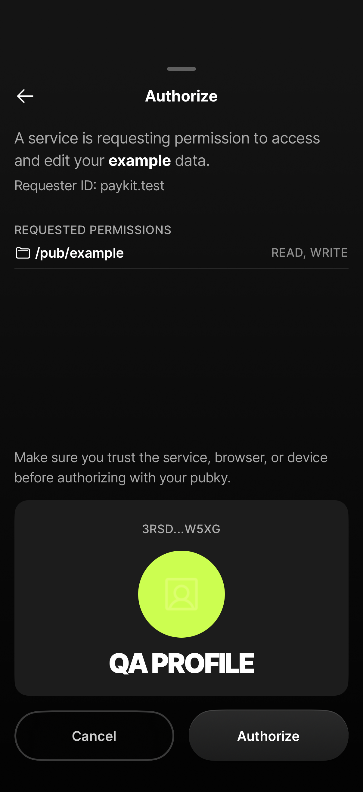
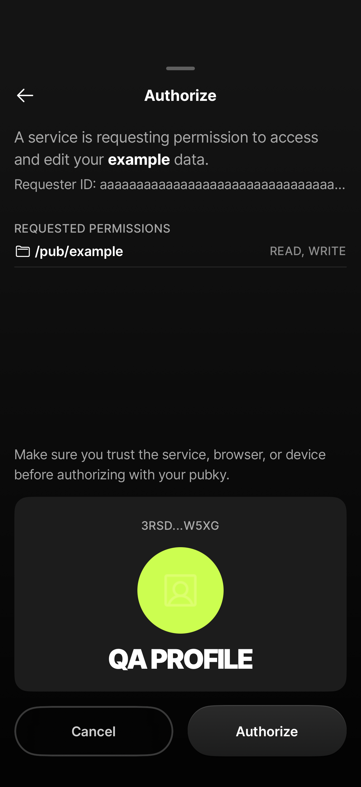

# Pubky authorization sheet

The authorization sheet shows the requester client ID above the permissions. A long client ID stays on one line and truncates at the end, leaving the trust warning and action buttons visible.

These screenshots render the app's sheet on an iPhone 17 simulator with iOS 26.5, using a local test profile and auth request. They show the approval layout without completing authentication.

| Requester ID | 253-character requester ID |
| --- | --- |
|  |  |
